# Toil

> A composable proof of work primitive on Bitcoin. Toil turns verifiable computational work into a callable resource that any OPNet contract can consume. Coin minting is the reference implementation. The primitive is the product.

[toil.org](https://toil.org)

## Table of Contents

1. [Vision](#vision)
2. [Why OPNet Makes This Possible](#why-opnet-makes-this-possible)
3. [What Toil Enables](#what-toil-enables)
4. [QBTC, Toil's Inaugural Deployment](#qbtc-toils-inaugural-deployment)
5. [Design Principles](#design-principles)
6. [The Three Contracts](#the-three-contracts)
7. [Deploying a Mining Pool](#deploying-a-mining-pool)
8. [The Proof of Work Pipeline](#the-proof-of-work-pipeline)
9. [Merge Mining with Bitcoin](#merge-mining-with-bitcoin)
10. [Score Computation and Variance Curves](#score-computation-and-variance-curves)
11. [Rounds and Share Accounting](#rounds-and-share-accounting)
12. [Minimum Target and Retargeting](#minimum-target-and-retargeting)
13. [Reward Determination](#reward-determination)
14. [Multi Algo Pools](#multi-algo-pools)
15. [Consuming Proofs from Other Contracts](#consuming-proofs-from-other-contracts)
16. [The Mixer Extension Model](#the-mixer-extension-model)
17. [The Reward Hook Extension Model](#the-reward-hook-extension-model)
18. [Security and Safety Considerations](#security-and-safety-considerations)
19. [A Worked Example from Start to Finish](#a-worked-example-from-start-to-finish)
20. [Parameters Reference](#parameters-reference)
21. [Summary](#summary)

---

## Vision

Toil is a primitive, not a product. The primitive is verifiable proof of work made composable and callable from any OPNet contract. The product is whatever anyone chooses to build with it. Coin minting is the most obvious application and the one we ship as a reference implementation, but it is not why Toil exists. It is an example of what Toil lets you do, not the reason Toil is interesting.

The reason Toil is interesting, and the reason it could not exist on any other smart contract platform, is that OPNet is a consensus layer built on Bitcoin rather than a chain beside it or a layer two on top of it. An OPNet contract can read Bitcoin state natively. It can verify Bitcoin transactions inline. It can compare a submission against Bitcoin's actual current block difficulty. This architectural position, which is specific to OPNet, is what lets Toil do something that every prior attempt at "mineable coins on a smart contract platform" could not do. Toil pipelines can be, if a creator chooses, literally the same double SHA256 work that Bitcoin miners are computing right now for Bitcoin itself. No translation layer, no wrapped form of hashrate, no bridged version of mining. The exact same hashes, verified inline by the exact same function Bitcoin uses.

The implication compounds. Any application on OPNet can now require verifiable computational work as a condition for any action it wants to gate, and the work it demands can be tied directly to the world's largest pool of mining hardware. The sybil resistance a contract gets this way is not bonded to a stake, not bonded to a captcha, not bonded to a social attestation. It is bonded to electricity and silicon, and specifically to the electricity and silicon that already secures Bitcoin. That is a different kind of primitive than anything currently exposed in smart contract ecosystems, because every other smart contract ecosystem lives at a distance from Bitcoin's actual hashrate.

One consequence deserves separate mention, because it is where Toil's long term ambition sits. The work a pipeline performs does not have to be arbitrary hashing. It can be any deterministic pure function, which means someone will eventually register a mixer whose computation is productive in its own right. A sparse matrix factorization step, a model inference pass, a protein folding iteration, a specific search space being explored. Gridcoin and Golem both chased this category on other substrates and neither succeeded, because they lacked a credible mechanism for verifying that the claimed computation actually happened and produced the claimed result. Toil's mixer interface is pure, deterministic, and pluggable by design, which is the shape of machine where that verification becomes feasible. Whether the ecosystem ever builds such a mixer is open, but the framework does not need to be redesigned to accommodate one, because the architecture already contemplates work that is not just hashing.

Toil is the connective tissue between that hashrate and OPNet contract state. Coin launching is the first thing people will do with it. The rest is up to the ecosystem. QBTC is the first asset born at that junction, and the framing that matters for the rest of this document is that Toil is the protocol, plus everything else that wants to use the same primitive.

---

## Why OPNet Makes This Possible

Understanding the architectural position OPNet occupies is load bearing for understanding why Toil is not just "0xBitcoin on a different chain." 0xBitcoin was the 2018 Ethereum project that introduced the mint-via-PoW pattern in an ERC20 contract, and it functionally failed to maintain adoption over the following years. Toil's design avoids 0xBitcoin's failure modes, but the deeper reason Toil can be something different is that OPNet sits somewhere fundamentally different on the protocol stack.

OPNet is not a layer two on Bitcoin. It is not a sidechain. It is not a bridged L1 that settles back to Bitcoin periodically. It is a consensus layer that lives on Bitcoin itself, which means OPNet contracts execute in an environment where Bitcoin's state is a first class input. A contract can see, within a single execution, what Bitcoin's current block hash is, what outputs a given Bitcoin transaction produced, what the network's current difficulty is, what a specific UTXO contains. None of this requires a bridge, an oracle, or a trusted relayer. It is native state access.

For Toil, this unlocks three things that are not possible on any other smart contract platform.

First, a pipeline can verify real Bitcoin work. A miner who finds a hash that satisfies Bitcoin's live difficulty condition can submit that hash to Toil as a proof of work, and the Core contract can verify, inline, that the work is genuine. This is merge mining in the strict technical sense, where the same hash simultaneously counts as a Bitcoin mining share and as a valid Toil submission.

Second, Toil pipelines can demand BTC payment as part of the submission envelope. If a pool's target definition checks that a specific Bitcoin transaction output paid a required amount to a specific address, the mining submission becomes conditional on a real Bitcoin payment landing at a real Bitcoin address. This is the same mechanism NativeSwap uses for its virtual reserve pattern. Toil gets the same primitive for free because it runs in the same environment.

Third, the economic gravity is different. Mining on Toil costs electricity to compute pipelines and gas to submit proofs. The gas is paid in BTC to OPNet's epoch miners, who are the validators securing the consensus layer. Every mining submission becomes a small BTC-denominated payment that flows from Toil miners to OPNet's security budget. This is not a fabricated utility loop, it is the same flow that every OPNet transaction produces, except that Toil creates sustained reason for these transactions to happen. Miners spend electricity because they expect to earn tokens. Tokens get earned by submitting to contracts that run on gas. Gas pays validators. Validators keep the network secure. The loop closes without Toil needing to hold any assets or act as any kind of treasury.

These three properties are interdependent. Remove Bitcoin state access, and merge mining dies. Remove the BTC-native gas flow, and the economic loop loses its anchor. Remove the consensus layer position, and Toil becomes one more commodity token launcher on one more sidechain. The framework is shaped around what OPNet specifically enables, which is also why it cannot be cloned to another environment without losing most of its purpose.

---

## What Toil Enables

Toil's value surface extends well beyond coin minting. The following are applications that become possible once verifiable proof of work is a callable primitive on OPNet. Some of these are things the Toil team will build as reference implementations, some are things other teams will build, and some are things nobody has built yet because the primitive has never existed.

**Real merge mining with Bitcoin.** Covered in its own section below, this is the capability that differentiates Toil from every similar attempt on other smart contract platforms. Bitcoin miners can submit shares they are already computing for Bitcoin and earn OPNet-native rewards without changing any of their hardware or workflow.

**Mineable coin launches.** The obvious application. A creator deploys a pool, configures a pipeline and target, picks a reward schedule, and miners start earning tokens. This is the reference implementation and it is useful on its own. It is also the thing that attracts initial mindshare because "fair launch mineable coin" is a concept people already understand.

**NFT minting via proof of work.** The reward of a pool does not have to be fungible. A pool can mint OP721 NFTs where the token metadata is derived from the final state of the submitted pipeline. Since pipelines are deterministic, each submission produces a specific, reproducible NFT. The art, rarity, or traits become a direct function of the work performed. A miner who finds a particularly deep hash can produce a rare NFT in a way that is transparently verifiable and impossible to fake.

**Useful work, eventually.** The mixer extension model means the set of operations a pipeline can perform is open ended. Someone will eventually register a mixer whose computational work is productive in its own right, a sparse matrix operation, a model inference pass, a protein folding step, a search space exploration. Gridcoin and Golem never cracked this category because they lacked a credible verification mechanism. Toil provides the shape of machine where it becomes feasible, because the mixer interface is pure, deterministic, and pluggable.

**Hashrate leasing markets.** Anyone can post a bounty in any OP20, specifying a pipeline and target, with the reward going to whoever first submits a valid proof. Bitcoin miners with spare capacity can opportunistically claim these bounties during slack periods in their main mining work. This turns Toil into a marketplace where anyone can purchase computational work from Bitcoin's existing mining infrastructure without needing to deploy hardware themselves.

**Sybil resistance for other protocols.** Any OPNet contract that wants to gate access by computational work can call into the Core as a read only query. A DEX could rate limit swap submissions to addresses that have submitted proofs recently, an airdrop contract could weight distribution by accumulated mining activity, a governance contract could weight votes by verified hashrate contribution. The Core exposes a verify-only entry point that other contracts consume as a pure function.

**Anti-bot and anti-MEV gating.** The same proof-of-compute primitive that underpins sybil resistance can also be used as a cost function for actions that bots would otherwise exploit. If submitting a trade requires a fresh proof from a configured pipeline, searchers pay in real compute rather than in gas priority. This changes MEV dynamics in ways capital-bonded systems cannot replicate, because compute cost is not tradeable the way priority gas is.

**Hashrate-selected committees.** A contract that needs a decentralized committee (for multisig operations, for oracle aggregation, for anything requiring trusted distributed actors) can select committee members from the top N miners on a specific Toil pool over the last K blocks. Committee membership becomes a function of contributed compute rather than locked capital. If a member stops mining, they fall off the committee and get replaced. This is a different shape of sybil resistance than PoS-based selection, and it inherits whichever hardware class the underlying pipeline targets.

**Verifiable randomness beacons.** A pool configured to emit proofs at a predictable cadence can serve as a source of unpredictable but verifiable randomness. The final state of each submission is deterministic given its inputs, but the inputs (nonces chosen by miners racing to find valid solutions) are not predictable in advance. Lotteries, auctions, loot drops, and fair-ordering primitives can consume this as a randomness source.

None of these require Toil to ship anything beyond the Core and a decent mixer library. They require creators, miners, and consuming contracts to build on top. The Core exposes the primitive. The ecosystem determines what it becomes.

---

## QBTC

QBTC is the first asset minted through Toil, and it is the specific deployment that clarifies what Toil is for. Reading this section should shift a reader's understanding of the framework from "a configurable mining factory" to "the protocol that made a Bitcoin-secured post-quantum monetary asset possible, plus everything else that wants to consume the same primitive." Everything in this document that comes after QBTC should be read as answering the question "what else can this machine do," because QBTC already demonstrates what it does first.

### What QBTC is

QBTC is an OP20 token on OPNet whose mining work is verified against Bitcoin's live block difficulty and whose supply curve follows Bitcoin's own schedule in real time. It is not a wrapped form of Bitcoin. It is not a bridged asset. It does not hold BTC anywhere, does not rely on a multisig, does not rely on a federation of signers, does not rely on any trusted party to mint or redeem. It is a parallel asset whose issuance is driven by Bitcoin mining and whose runs on OPNet's native post-quantum signature scheme.

The supply rules are not just modeled after Bitcoin's, they are Bitcoin's remaining schedule carried forward onto OPNet. QBTC's total cap is set at genesis to exactly what remains of Bitcoin's 21,000,000 cap at that moment. If QBTC launches at a Bitcoin block where roughly 19.85 million BTC have already been mined, the total QBTC supply cap is roughly 1.15 million, and not a single unit more will ever exist. The cap is not a copy of Bitcoin's number, it is the difference between Bitcoin's cap and Bitcoin's circulating supply at the specific Bitcoin block where QBTC is deployed. Early Bitcoin miners who got fifty BTC per block in 2009 do not get replayed in QBTC distribution. Their era is gone. QBTC starts from right now.

The per-block issuance mirrors Bitcoin's live subsidy in real time. The QBTC reward hook reads the current Bitcoin block height from OPNet's native block context, computes Bitcoin's block subsidy at that height using Bitcoin's own halving formula (initial reward shifted right by height divided by 210,000), and returns that amount. If Bitcoin is in its 3.125 BTC era when QBTC launches, QBTC is a 3.125 per block coin. When Bitcoin halves to 1.5625 at block 1,050,000, QBTC halves to 1.5625 at the same block. When Bitcoin reaches its final satoshi sometime around year 2140, QBTC reaches its final unit at the exact same Bitcoin block. QBTC is not a coin inspired by Bitcoin's schedule, it is Bitcoin's remaining monetary future, minted in parallel on OPNet's post-quantum rails.

The custody rules are different from Bitcoin, and this is where the quantum angle enters. Bitcoin authorizes spending from an address using either ECDSA on secp256k1 or Schnorr signatures on the same curve. Both of those schemes are broken by Shor's algorithm on a sufficiently capable quantum computer. OPNet uses MLDSA, the lattice based signature scheme standardized by NIST as FIPS 204 (Dilithium), which is quantum resistant by construction. QBTC inherits that custody model because it lives on OPNet. The mining side is quantum safe by accident, because SHA256 was always fine under Grover's algorithm. The spending side is quantum safe by design, because MLDSA was selected specifically to survive the quantum transition that would break Bitcoin's current signatures.

### How the pool is configured

The configuration is almost embarrassingly simple given everything else the framework supports. The creator selects the fresh OP20 deployment mode, names the token QBTC with eight decimals, and sets the supply cap to exactly the difference between Bitcoin's 21,000,000 cap and Bitcoin's circulating supply at the launch block. The Core deploys a standard OP20 wrapper and records the QBTC genesis Bitcoin block height permanently in the pool configuration, because every subsequent reward calculation references this anchor. The pipeline contains a single stage, a target check that verifies the submitted nonce produces a double SHA256 hash meeting Bitcoin's live block difficulty divided by a configurable factor K. The variance curve is LINEAR. The reward schedule is a hook rather than a built in halving, because the hook needs to read Bitcoin's block height from `Blockchain.block.number` (which on OPNet is Bitcoin's block height) and compute Bitcoin's block subsidy at that height using Bitcoin's own formula. The returned value is the per-round QBTC reward, tracking Bitcoin's remaining issuance at each block. The round length matches Bitcoin's block cadence by design.

The K factor controls how often a Bitcoin share also qualifies as a QBTC submission. At K equals one, only full Bitcoin block hashes qualify, which is too rare to produce a meaningful submission stream. At K equals ten thousand, any hash ten thousand times easier than a full Bitcoin block qualifies, which is still ASIC grade difficulty but occurs often enough to drive a steady flow of submissions across the Bitcoin mining industry. The correct K is tuned to produce the desired submission rate given current Bitcoin hashrate, and can be set to mirror Bitcoin's own share accounting conventions used by major pools.

That is the entire configuration. No custom mixers, no external mixer contracts, no exotic target logic, no elaborate witness format. The pool inherits Bitcoin's mining distribution because miners who are already finding Bitcoin shares will find QBTC shares at a proportional rate. It inherits Bitcoin's halving schedule because the hook reads Bitcoin's own height. It inherits Bitcoin's remaining supply for the same reason. What gets added on top is only the OP20 wrapper that makes QBTC a normal token on OPNet, plus OPNet's native post-quantum custody for everything downstream of mining.

### Why QBTC is not 0xBitcoin

0xBitcoin shipped in 2018 on Ethereum with a similar looking mint-via-PoW pattern, and it functionally failed to retain adoption over the following years. Understanding why it failed is important, because the reasons are specific enough that QBTC does not inherit them.

0xBitcoin used Keccak256 as its mining hash, which is Ethereum's native hash function. Keccak256 is not what Bitcoin ASICs compute. So the "mineable coin with Bitcoin narrative" pitch was structurally incoherent from day one. The coin took the Bitcoin branding and the Bitcoin distribution aesthetic while actually being mineable only by GPUs running an Ethereum-friendly hash. The Bitcoin mining industry was not its mining base, and could not be, because Ethereum contracts cannot verify SHA256 against Bitcoin's difficulty the way OPNet contracts can. The narrative was Bitcoin, the mining was Ethereum, the demographic mismatch was permanent.

Toil runs inside OPNet, which runs inside Bitcoin's consensus layer. Double SHA256 is literally what every Bitcoin ASIC does all day, every day. Foundry, Antpool, F2Pool, MARA, CleanSpark, Riot, and every independent Bitcoin mining operation can point hardware at QBTC with zero marginal compute cost, because the hashes they are already computing for Bitcoin include the hashes that would qualify for QBTC at the configured K factor. The only additional cost is the OPNet gas fee to submit the proof, which is trivial relative to the value of the hashrate being contributed. This is the unlock 0xBitcoin could not have, and it is the unlock that makes QBTC a different animal rather than a reissue of the same idea.

### The quantum framing, honestly

When people say Bitcoin is not quantum safe, they mean specifically the signature schemes used to authorize spending from Bitcoin addresses. ECDSA on secp256k1 and Schnorr signatures on secp256k1 both fall to Shor's algorithm on a sufficiently large quantum computer. If and when a quantum computer capable of running Shor at 256 bit scale arrives, every existing Bitcoin balance secured by an exposed public key becomes vulnerable.

What does not fall is the mining side. SHA256 is vulnerable to Grover's algorithm, which gives a quadratic speedup against preimage search, reducing effective preimage security from 256 bits to 128 bits. One hundred and twenty eight bits is safely beyond any realistic attack budget for the foreseeable future. Hash based mining survives the quantum transition. Signature based custody does not.

MLDSA, which OPNet uses natively, is quantum resistant by construction. It is the primary digital signature standard selected by NIST in FIPS 204 specifically to survive the quantum transition. QBTC spending signatures run through MLDSA because QBTC lives on OPNet, which means the custody side of QBTC is quantum safe for free.

The honest assessment of the quantum pitch is that it is partly a marketing hook and partly a real property. Quantum computers capable of breaking 256 bit elliptic curve cryptography do not exist today and may not arrive for years. Bitcoin may also add a post-quantum signature option before the quantum threat becomes consequential. So the urgency of "you need quantum safe Bitcoin now" is overstated if taken literally. But the structural property is real and not overstated. QBTC custody is quantum safe today, Bitcoin custody is not, and anyone who wants exposure to Bitcoin's monetary properties without exposure to Bitcoin's signature vulnerability has a cleanly defined asset to hold. If the quantum threat never materializes seriously, QBTC remains an interesting parallel asset with an unusually clean launch story and a clean Bitcoin-analog role in OPNet DeFi. If the quantum threat does materialize, QBTC holders had the right hedge years in advance. Both outcomes work, which is the hallmark of a positioning that is not pretending to be more than it is.

### What QBTC does for the OPNet ecosystem

The ecosystem effect is the part that matters beyond QBTC itself. Every Bitcoin mining operation that touches QBTC acquires an OPNet wallet, because receiving OP20 tokens requires an OPNet address. This means thousands of entities that today have zero OPNet presence (major pools, independent mining operations, cloud mining services, pool operators) get a reason to create OPNet accounts and start holding OP20 balances. Each QBTC submission is also an OPNet transaction that pays OPNet gas to the epoch miners securing the consensus layer, which flows Bitcoin denominated value directly into OPNet's security budget without Toil holding any assets or acting as any kind of treasury.

Beyond the pipe into the mining industry, QBTC fills a specific role in OPNet DeFi that nothing else currently fills. Ethereum DeFi has WBTC as the standard "Bitcoin-like pair asset" that every liquidity pool, lending market, and derivative protocol uses as its BTC proxy. OPNet does not have an equivalent today. QBTC becomes that asset, with the difference that it does not require a bridge, does not require a custodian, does not require anyone to lock real BTC anywhere. It trades at whatever price the market assigns given its own issuance dynamics and demand, which is likely to be some discount to actual Bitcoin (because QBTC is not redeemable for Bitcoin and has no peg), but it does not need price parity with Bitcoin to play the pair asset role. It just needs to be a credible Bitcoin analog that DeFi can pair against, which it structurally is, because its monetary policy is a direct copy of Bitcoin's and its mining is driven by the same hashrate.

This is the liquidity primitive that OPNet needs. Not a wrapped Bitcoin secured by a trusted multisig, which introduces a trust assumption the ecosystem does not want to take on, and not a virtual reserve token whose backing is fictional, but a credibly fair launched asset whose mining demography is Bitcoin's own mining industry and whose monetary rules are Bitcoin's own monetary rules. QBTC is that asset.

### Caveats worth naming

The early hours and days of QBTC mining will be uneven in a specific way worth understanding. If a single large Bitcoin pool decides to point significant hashrate at QBTC before others do, that pool will accumulate a disproportionate share of the initial supply before Toil's retargeting catches up to the new hashrate level. This is true of any mineable launch, but it is more pronounced when the mining base is Bitcoin-scale hashrate that can arrive all at once rather than consumer GPUs that trickle in. The mitigation is transparency about launch timing and a sufficiently aggressive initial difficulty that the first few rounds are not trivially grabbed.

QBTC will trade at some discount to Bitcoin's price, forever, because it is not redeemable for Bitcoin and never will be. The size of that discount depends entirely on how much adoption the narrative gets, how useful QBTC turns out to be as an OPNet DeFi pair asset, and how much of the Bitcoin mining industry decides it is worth the gas cost to participate. The range of possible outcomes is wide. A thoughtful range to plan against is QBTC trading at one percent to ten percent of Bitcoin's price during normal conditions, with the expectation that any serious materialization of the quantum narrative could move that number.

---

## Design Principles

Before describing the contracts, it's worth stating the principles that shape every decision in this document. These principles are what make the system simple enough to actually ship and robust enough to trust with real money.

**The first principle is that pools are immutable after creation.** Once a creator deploys a mining pool with a specific pipeline, target, curve, caps, and reward schedule, those parameters can never change. This is the same guarantee that Uniswap V3 pools make to liquidity providers, and for the same reason, which is that miners need to know the rules they are mining under will not be changed out from under them. If a creator wants to launch an improved version, they launch a new pool. Immutability at the pool level is what makes the protocol trustworthy.

**The second principle is that state updates are always constant cost.** No function in any contract in this protocol ever iterates over an unbounded list. Every submission, every claim, every round transition runs in a fixed number of storage operations regardless of how many miners are participating or how many rounds have elapsed. This is achieved through the running totals pattern, where every submission incrementally updates aggregate values so that at any moment the contract holds the final numbers without needing to recompute them.

**The third principle is that trust is minimized wherever possible.** The protocol does not rely on off chain aggregators, bonded posters, or trusted operators. A miner who participates honestly can always claim their share using only the information on chain. This is more expensive in gas than an optimistic design with off chain indexers would be, but it is the right tradeoff for a foundational primitive where every external trust assumption compounds across all applications built on top.

**The fourth principle is extensibility without migration.** The initial deployment of the protocol ships with a curated set of mixers and targets. Over time, new mixers can be added, but they only affect pools deployed after the addition. Existing pools retain the exact set of mixers they were deployed with, forever. This means a creator can look at the registry on the day they launch, pick their pipeline, and know with certainty that their pool's mining rules will work identically in ten years even if the registry has grown tenfold.

**The fifth principle is that the protocol is composable by design.** Creators can combine mixers in any valid order, pick any target for any pipeline, choose any variance curve, and optionally plug in their own reward hook contract. Other OPNet contracts can consume Toil proofs for their own purposes via a stateless verification entry point. The combinatorial space is enormous, but every combination is either valid and deployable or rejected at deployment time with a clear error. There is no path by which a creator can deploy a broken pool, and there is no path by which a consuming contract can be tricked into accepting an invalid proof.

---

## The Three Contracts

The protocol consists of exactly three types of contracts. Understanding how they divide responsibility is the key to understanding everything else.

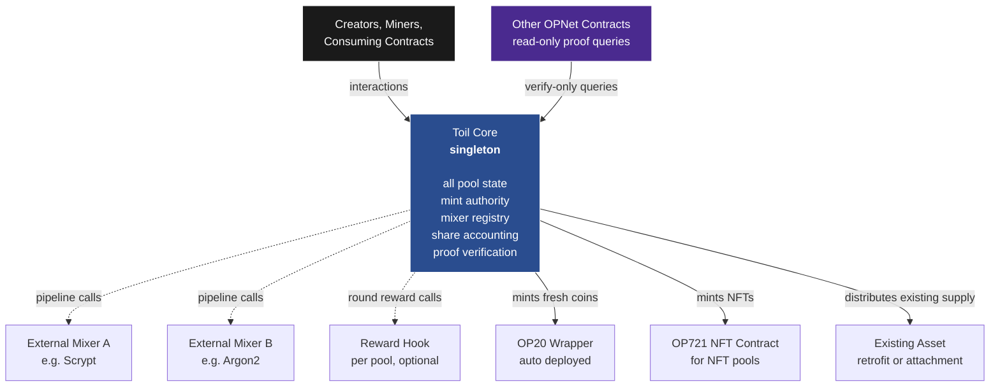

### The Core

The Core is the main contract, deployed once, forever. It is the single entry point for everything a creator, miner, or consuming contract needs to do with the protocol. When someone wants to launch a pool, they call the Core. When a miner wants to submit a proof of work, they call the Core. When a miner wants to claim their rewards, they call the Core. When someone wants to propose a new mixer contract for registration, they call the Core. When another OPNet contract wants to ask whether a specific submission is valid for some pipeline configuration, it calls the Core's read-only verification interface.

The Core contains every piece of state the protocol needs. It stores the registry of available mixers and targets, the configurations of every pool ever deployed, the mining state for every active round across every pool, the pending reward balances for every miner across every pool, the total supply and issuance tracking for every coin the Core mints, the mint authorities for any externally owned coins attached to a pool, and the deposited asset reserves for pools that distribute from existing supply rather than minting new supply.

Because everything lives in the Core, miners, creators, and consuming contracts never need to track multiple contract addresses. The Core is the protocol. All external contracts (mixers and reward hooks) are called out to from the Core rather than being user facing. A miner never calls a mixer contract directly, they submit to the Core, and the Core invokes whichever mixers the target pool's pipeline specifies.

The Core also deploys auxiliary contracts on demand when a pool needs one. For pools minting fresh OP20 tokens, the Core deploys a thin OP20 wrapper so wallets and DEXes can interact with the token via the standard interface. For pools minting OP721 NFTs, the Core deploys a minimal NFT contract. These auxiliary contracts are fixed template code, not creator configurable, and they exist purely to expose standard interfaces to the broader ecosystem. From the creator's and miner's perspective, they are invisible, interactions always go through the Core.

### Mixer Contracts

Mixer contracts are external, pluggable, and pure. Each mixer implements a single interface method that takes a state (some bytes), a set of parameters (bytes, configured by the pool creator at deployment), and a witness slice (bytes, provided by the miner at submission time), and returns a new state plus a count of how many witness bytes it consumed. Mixers perform no state changes, emit no events, and make no cross contract calls. They are pure transformations.

At launch, the Core ships with an initial set of built in mixers whose logic is compiled into the Core itself for gas efficiency. These core mixers include SHA256 chain, SHA1 chain, double SHA256, Keccak256 chain, Xorshift u64 rounds, Mersenne prime multiply add, data dependent rotation chain, sequential memory walk (small and medium variants), random index memory walk, bipartite edge PRG, Merkle tree PRG, INT32 matmul modulo prime, HMAC SHA256, and tagged hash. These are the bread and butter of hardware differentiated proof of work, and having them inline in the Core saves miners the cross contract call overhead that an external mixer would incur.

When someone wants to add a mixer that isn't in the initial set (such as Scrypt, X11, Lyra2, Argon2, VerusHash, a custom matmul variant with specific bit width, a productive work function like matrix factorization, or any other hash primitive), they deploy it as an external contract implementing the mixer interface. They submit a registration proposal to the Core, which includes metadata about the mixer (expected witness size, estimated gas cost, description). The Core's governance process (initially a designated owner, eventually a more decentralized mechanism) reviews the mixer and either approves or rejects it. Approved external mixers get a stable registry ID and can be referenced by any new pool from that point forward.

Crucially, adding a new mixer never affects pools that already exist. A pool's pipeline is baked in at deployment and references mixers by ID. Those ID references are resolved once, at deployment, against the registry as it existed at that moment. Later changes to the registry cannot retroactively modify a pool's behavior.

### Reward Hook Contracts

Reward hook contracts are optional, creator deployed, and used only by pools whose creator wanted custom emission logic. A reward hook implements a single method that the Core calls at round settlement time to determine how many tokens should be minted or distributed as that round's reward pool. The hook receives the round ID and current block number and returns an integer amount.

Reward hooks enable emission schedules that the built in options cannot express. Some examples of what hooks make possible include emissions that scale with the coin's price via an oracle, emissions that burn tokens from the reward pool based on network metrics, emissions that pause during low activity rounds, emissions that coordinate with other pools via cross contract reads, and emissions governed by on chain votes.

If a creator doesn't specify a hook at pool deployment, the Core uses an inline default schedule instead. Three default schedules are supported: fixed rate (constant reward per round forever), halving (reward halves every N rounds until zero), and tail emission (halving until a specified round, then constant tail reward forever, which is Monero's model). These cover the vast majority of real world emission designs and avoid the gas cost of a hook call for creators who don't need anything exotic.

The hook address is immutable once set. A creator cannot swap in a different hook after the pool launches, because that would let them rug miners by changing the reward curve after the fact.

---

## Deploying a Mining Pool

A creator sits at a frontend that talks to the Core. They are designing a new mining pool. The pool can reward any asset type the Core supports, and the creator picks one of four modes based on what they are trying to do.

### Mode A, fresh OP20 coin

The Core generates a new coin ID, deploys a standard OP20 wrapper with the creator's chosen name, symbol, and decimals, and configures the wrapper so that only the Core is authorized to mint. Mining submissions cause new supply to be minted up to a configured maximum cap.

This is the "launch a new mineable coin" case. The wrapper exists so that wallets and DEXes see the token as a normal OP20. The creator never interacts with the wrapper directly.

### Mode B, existing OP20 with delegated mint authority

The creator owns an existing OP20 contract and wants to add mining as an ongoing emission mechanism. They prove ownership by signing a message from the owner address, and they grant the Core mint authority on their OP20 in a separate transaction. Once both conditions are satisfied, the Core records the external address under a new pool ID and can mint fresh supply as mining rewards.

This mode is useful for projects that already have a deployed token and want to add PoW-based distribution without migrating holders to a new contract.

### Mode C, retrofit pool distributing existing supply

The creator holds a supply of any OP20 token (their own, someone else's, a retrofitted community project, whatever) and wants to distribute that supply as mining rewards. They do not need mint authority. They do not need the token creator's cooperation. They transfer tokens they already own into the Core as the pool's reward reserve, and configure a pool that distributes from that reserve.

This mode is the one that turns Toil into a general distribution mechanism for any OP20 that exists on OPNet. A holder of PILL, MOTO, or any other existing token can create a mining pool that distributes their own holdings. A DAO can allocate treasury funds to a retrofit mining pool as an alternative to airdrops or liquidity mining. A project that wants to reach new holders can buy tokens on the open market, deposit them into a Toil pool, and let miners distribute that supply through proof of work. The pool's reward budget is strictly capped by the deposited reserve, and the Core never mints tokens it does not have the authority to mint.

### Mode D, NFT minting

The pool mints OP721 NFTs instead of OP20 tokens. The Core deploys an NFT contract for the pool and mints a new token on each valid submission, or on a schedule the creator configures. The NFT's metadata can be derived deterministically from the final pipeline state, so each mined NFT is uniquely tied to the work that produced it.

This mode is useful for gamified distribution, collectibles where rarity corresponds to mining quality, or any application where the reward is a discrete, non-fungible item rather than a share of a token pool.

### Deployment flow

Regardless of mode, the Core validates the configuration end to end before accepting the deployment. It checks that every mixer ID in the pipeline exists in the registry. It checks that the target ID exists. It checks that the total witness size the pipeline will consume does not exceed the calldata cap. It runs a simulation of a single dummy submission against the pipeline and target to verify that the verification gas cost fits inside OPNet's transaction gas ceiling. It checks that emission schedule parameters are consistent. For Mode C, it verifies that the claimed reserve tokens have actually been transferred. For Mode B, it verifies that mint authority has actually been granted. If any validation fails, the entire creation reverts with a specific error, so the creator can fix the issue and try again.

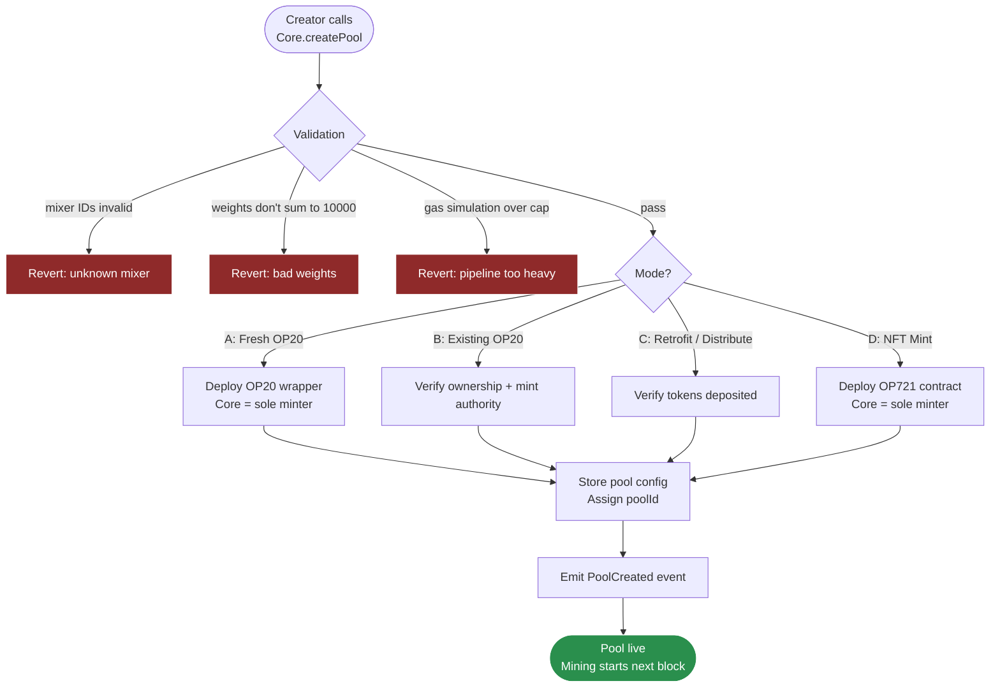

From the creator's perspective, they made a single contract call (the pool creation call on the Core) and walked away with a fully deployed mining pool. They never directly interact with any auxiliary contracts.

### Trust notes

Mode A is fully self contained. The Core deploys the wrapper, the Core holds mint authority, nothing external can change that. Safest mode.

Mode B carries a trust assumption on the external contract's bytecode. If the original owner kept a hidden backdoor that lets them mint unlimited supply behind the Core's back, Toil cannot detect or prevent that. Community due diligence on the external contract is the only mitigation.

Mode C is trust minimized in a different way. The Core holds the deposited reserve directly, so nobody can mint unauthorized supply. The only risk is that the creator deposited a low value token and the pool produces nothing miners actually want to earn, which is a market risk rather than a protocol risk.

Mode D shares Mode A's safety profile for the NFT contract itself.

---

## The Proof of Work Pipeline

Every pool defines its mining work as a pipeline of mixers followed by a target check. This is the heart of the framework. Understanding how a pipeline executes is understanding how the whole protocol computes whether a submission is valid and how much it should be rewarded.

When a miner wants to submit a proof of work, they have computed off chain a specific combination of a nonce (a 32 byte value they choose) and a witness (a variable length byte string that contains whatever auxiliary data the pipeline and target need to verify their submission, such as Merkle proof openings, cycle edge nonces, Freivalds verification vectors, Bitcoin transaction data, or whatever else the specific pipeline demands). The miner sends both to the Core in a submit call, along with the pool ID and the algorithm index (0 if the pool is single algo, or which sub algorithm they're submitting to if the pool is multi algo).

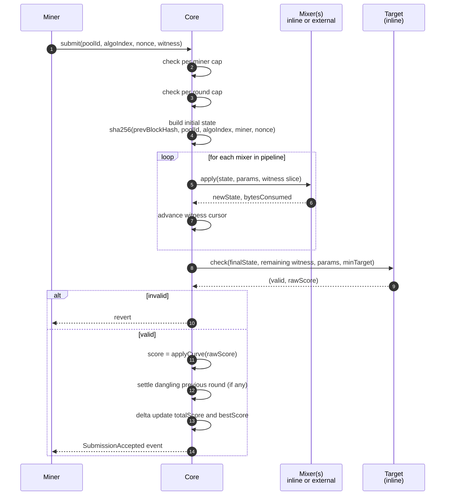

The Core begins pipeline execution by constructing an initial state. The state is a fresh byte buffer containing the round's seed material: the hash of the previous round's finalizing block, the pool ID, the algorithm index, the miner's address, and the miner's submitted nonce, all concatenated and hashed with SHA256 to produce the starting state. Binding the miner's address into the state is what prevents a miner from stealing another miner's valid submission and resubmitting it as their own, since a different miner address produces a different state and therefore a different final hash.

With the initial state established, the Core iterates through the pipeline's mixer list. For each mixer, it looks up the mixer in the registry (which tells it whether the mixer is inline in the Core or external at some address), loads the parameters for this mixer from the pool's stored configuration, takes a slice of the witness corresponding to however many bytes the mixer declared it needs, and invokes the mixer's apply method with the current state, the parameters, and the witness slice. The mixer transforms the state and returns the new state plus a confirmation of how many witness bytes it actually consumed. The Core advances its witness cursor by that many bytes and moves on to the next mixer.

After all mixers have been applied, the final state is passed to the target check. The target looks at the state, the remaining witness bytes (some targets consume witness, such as Cuckoo cycles which need the 42 edge nonces, or Bitcoin-difficulty targets which need the raw Bitcoin header fields), the target's configured parameters, and the pool's current minimum difficulty. The target returns two values: a boolean indicating whether the submission is valid, and an integer score indicating how much work this submission represents relative to the minimum.

If the submission is invalid, the whole call reverts. If it is valid, the Core applies the pool's variance curve to the raw score to produce the final submission score, then proceeds to update the mining state.

### An example pipeline execution

Consider a pool configured with a four mixer pipeline: SHA256 anchor, sequential memory walk of 1 megabyte with 50,000 iterations, Mersenne prime multiply add with 10,000 rounds, SHA256 anchor. The target is a classic difficulty check, which interprets the final 32 byte state as a big integer and compares it to a target value. The variance curve is LINEAR.

A miner computes a submission off chain by running the same pipeline in their mining software. They pick a random nonce, start with the initial state (which includes their address), run the four mixers in order, produce a final state, interpret it as an integer, and check whether it beats the current minimum target. If not, they pick a new nonce and try again. They iterate trillions of times until they find a nonce whose final state is an integer small enough to pass.

When they submit to the Core, the Core recomputes the same pipeline. It arrives at the same final state because the computation is deterministic (given the same inputs, every mixer produces the same output). The target check confirms the integer is below the minimum target and assigns a score based on how far below. Since the variance curve is LINEAR, the stored score equals the raw score. The submission is accepted and the state is updated.

The verification cost depends entirely on the pipeline. The two SHA256 anchors are cheap, a few thousand gas each. The memory walk is more expensive, because it has to allocate and iterate over a 1MB buffer 50,000 times, though the iterations themselves are simple hashes and updates. The Mersenne prime multiply add is modest, a few u64 operations per round. The target check is negligible. The total verification cost for this pipeline is on the order of a few million gas units, well within OPNet's transaction ceiling, but expensive enough that a creator needs to be thoughtful about how heavy they make their pipelines.

---

## Merge Mining with Bitcoin

This is the capability that differentiates Toil from every similar project on every other smart contract platform. It is made possible by OPNet being a consensus layer on Bitcoin rather than a separate chain, and it is the single most strategically important feature Toil ships.

The core idea is straightforward. A pool creator configures a pipeline whose target condition is "this hash satisfies Bitcoin's current block difficulty divided by a configured factor K." The Core can verify this target inline because OPNet contracts can read the current Bitcoin block difficulty natively. Any miner who finds a hash meeting that condition can submit it to the Core as a valid proof of work, and the Core accepts it.

The consequence is that Bitcoin miners, who are already computing SHA256 hashes against Bitcoin's actual difficulty, can have a fraction of their shares (specifically, any share that meets the lowered difficulty of `bitcoinDifficulty / K`) count as valid Toil submissions. At K = 1000, roughly one in every thousand Bitcoin hashes that would be valid for Bitcoin would also be valid for Toil. At K = 1,000,000, roughly one in every million.

The economics of this are different from any other mining setup. A Bitcoin miner computing a Toil merge mining submission pays zero marginal compute cost, because they were going to compute that hash anyway for their Bitcoin mining. The only additional cost is the OPNet gas fee to submit the proof, which pools can amortize by batching many shares into a single submission. At that point, the "is the gas fee worth it" question becomes a question about the value of the reward relative to the gas, not about whether the mining itself is profitable.

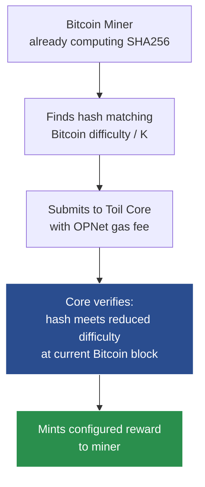

### Why this pulls Bitcoin miners into OPNet

Bitcoin miners are one of the hardest populations in crypto to attract, because their hardware is specialized, their economics are thin, and their tooling is mature around Bitcoin specifically. Nothing less than "additional income for zero additional work" tends to get their attention. Merge mining with Toil is exactly that proposition. A miner does not have to run new hardware, change their pool software significantly, or take on any risk. They just submit any reduced-difficulty shares they happen to find to a Toil pool, and if the reward is worth the gas, they collect.

When F2Pool, Foundry, Antpool, or any major Bitcoin mining pool operator looks at Toil and asks "is this worth the integration work," the answer depends entirely on whether there exists any Toil pool whose reward value exceeds the gas cost amortized across expected shares. This is a question of emerging token valuations and gas market conditions, not a question of mining infrastructure. Once any pool crosses that threshold, the mining industry starts paying attention, and the dynamic reverses from "miners reluctantly considering Toil" to "miners actively looking for profitable Toil pools to add to their rotation."

### The ecosystem effect

Bitcoin miners participating in Toil produce three compounding effects on OPNet. First, they pay gas fees in BTC to OPNet's epoch miners, which directly subsidizes the security of the consensus layer. Second, they hold Toil-mined tokens, which gives those tokens a large and economically aligned holder base. Third, by touching OPNet contracts at all, they become familiar with OPNet as a platform, which opens the door to them participating in other OPNet applications over time.

None of this depends on Bitcoin miners caring about any specific token. It depends only on Bitcoin miners being economically rational actors who will claim free money when it is offered. Merge mining converts Toil from a framework with a cold start problem into a framework with an automatic distribution pipe to the world's largest pool of mining hardware.

### The honest caveat

The merge mining economics only work if token values are high enough to justify the OPNet gas cost per submission. For a new pool with a low-value token, the break-even point might require batching thousands of shares per submission, or the pool might simply not attract merge miners until its token has some market capitalization. This is a bootstrapping curve, not a design problem. Dogecoin went through the same curve when it merge-mined with Litecoin. The curve resolves upward if the token has any real demand, and it resolves downward (the pool fades away) if it doesn't. Either outcome is fine for Toil as a framework. The framework's job is to make the pattern possible, not to guarantee any specific pool succeeds.

---

## Score Computation and Variance Curves

The target returns a raw score, which is always computed the same way for difficulty based targets: the raw score equals the pool's minimum target (as a 256 bit integer) divided by the submission's hash (also as a 256 bit integer). This is the standard mining pool share accounting formula, known in Bitcoin as pdiff. It produces a unit free number representing how many multiples of the minimum work the submission represents. A submission exactly at the minimum gets a raw score of 1. A submission twice as deep as the minimum gets a raw score of 2. A submission a thousand times deeper gets a raw score of 1000.

For non difficulty targets (like Cuckoo cycle, Bitcoin merge-mining, or attestation), the target computes raw score using a scheme appropriate to that target. A Cuckoo target might assign raw score based on the cycle's minimum edge value (deeper cycles earn more). A Bitcoin merge-mining target assigns raw score proportional to how deep below Bitcoin's current difficulty the submitted hash is. An attestation target might return a fixed raw score of 1 per valid attestation. Each target type documents its raw score formula so creators know what they're picking.

The raw score is then transformed by the pool's variance curve into the final submission score, which is what gets stored on chain and used for pool share calculations. Four curves are available.

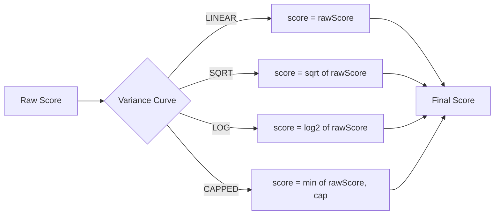

### Linear

The final score equals the raw score. This is the default and what most miners expect. A submission twice as deep gets twice the share. A submission a thousand times deeper gets a thousand times the share. Linear produces the highest variance profile, because one lucky miner finding a deep hash can dominate the round.

### Square root

The final score equals the integer square root of the raw score. A submission twice as deep gets about 1.4 times the share. A submission a thousand times deeper gets about 32 times the share. Square root compresses the spread, giving the lucky miner less dominance and letting mid tier miners claim more of the pool. Variance per round is lower.

### Logarithmic

The final score equals the base two logarithm of the raw score, rounded to an integer. A submission twice as deep gets one more share than the baseline. A submission a thousand times deeper gets about ten more shares. Logarithmic is roughly equivalent to counting extra difficulty bits. Variance is very low, nearly flat.

### Capped

The final score equals the raw score up to a configured ceiling. Above the ceiling, the score caps out. A submission ten times deeper than the cap gets exactly the same share as a submission one times deeper than the cap. This is useful for pools that want fair linear payouts under normal conditions but want to prevent lucky outliers from dominating.

### Worked comparison

Imagine a round with ten miners, whose raw scores are 1, 2, 4, 8, 16, 32, 64, 128, 256, and 2048. The total raw score is 2559. Under LINEAR, the lucky miner with 2048 gets 2048 divided by 2559, which is about 80 percent of the pool. Under SQRT, the square roots are 1, 1, 2, 2, 4, 5, 8, 11, 16, and 45, total 95. The lucky miner gets 45 divided by 95, which is about 47 percent. Under LOG, the logs are 0, 1, 2, 3, 4, 5, 6, 7, 8, 11, total 47. The lucky miner gets 11 divided by 47, which is about 23 percent.

| Curve | Lucky miner's share | Mid tier miner's share |
|---|---|---|
| LINEAR | ~80% | small |
| SQRT | ~47% | meaningful |
| LOG | ~23% | nearly equal |

The creator picks the curve that matches the feel they want for their pool. LINEAR is the purest expression of "reward in proportion to expected work", which is what Bitcoin and traditional mining pools do. SQRT is what creators pick when they want to attract smaller miners who would otherwise feel outcompeted by whales. LOG is approximately egalitarian and suits pools that want to emphasize participation over competition. CAPPED is the middle ground with an explicit ceiling for predictability.

Regardless of curve, all scores are capped at the u64 maximum before being stored, as a safety measure. In LINEAR mode, a raw score could theoretically be enormous if a miner finds a hash that is absurdly small (though this is vanishingly rare in practice). Capping at u64 ensures that the subsequent arithmetic in share accounting stays inside predictable bounds.

---

## Rounds and Share Accounting

A round is the basic unit of reward distribution. The protocol groups submissions into rounds based on block height, so every X blocks is a round, where X is the pool's configured round length. Shorter rounds mean more frequent reward distribution and smaller variance between rounds. Longer rounds mean less frequent but larger reward events.

A round has no explicit start or finalization transaction. It begins when a block at the right height is mined on OPNet and it ends when a block at the next boundary is mined. The Core doesn't need to be called to open or close a round. Submissions in the current round write to storage slots keyed by (pool ID, current round ID, algorithm index), and those slots just stop being written to once the round boundary is crossed, because new submissions land in storage slots keyed by the next round ID. The previous round's data becomes immutable simply by virtue of no one ever writing to it again.

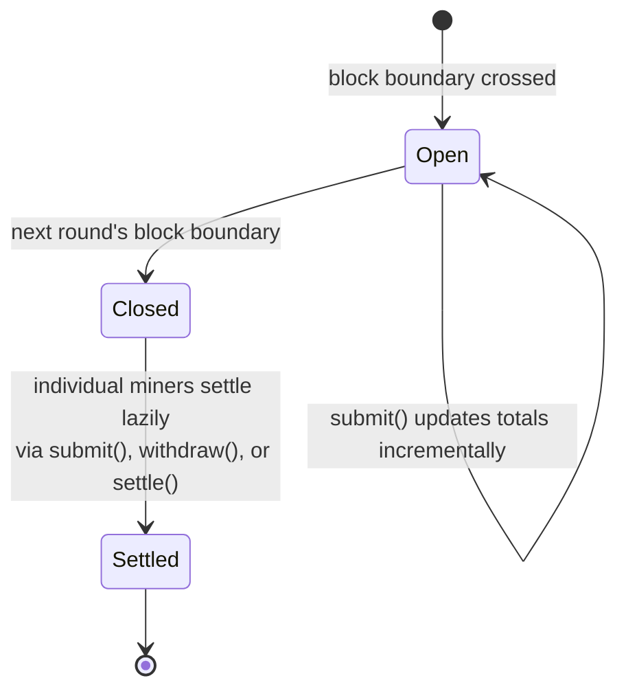

### What the Core stores per round

For each pool and each round, the Core stores a small set of aggregate numbers: the round's reward pool (the total tokens or NFTs allocated to this round, which is either computed inline from the schedule or fetched from the hook, or drawn from the deposited reserve for Mode C), the total score (the sum of all miners' best scores this round), the submission count (for enforcing the per round cap), and the round's minimum target (frozen at round start). For each (pool, round, algorithm, miner) tuple, the Core stores the miner's best score for this round, and the miner's submission count for this round. For each (pool, miner) tuple globally, the Core stores the miner's pending balance (accumulated unclaimed rewards) and the miner's last active round per algorithm (used for settling).

None of these are arrays. All of them are keyed storage slots. The Core never iterates any of them. Every update touches a constant number of slots, regardless of how many miners or rounds exist.

### Submission, step by step

When a miner calls submit with their nonce and witness, the Core does the following in order.

First, it determines the current round by dividing the current block height by the pool's round length. This is a pure computation, no storage read needed beyond the pool configuration.

Second, it checks the per miner submission cap for this round. If the miner has already submitted the maximum number of times (default 10) to this algorithm in this round, the call reverts. Otherwise, it increments the counter.

Third, it checks the per round total submission cap. If the round has already received the maximum number of submissions (default 500) to this algorithm, the call reverts. Otherwise, it increments the counter.

Fourth, it runs the pipeline and target as described in the previous sections, producing a final score. If validation failed at any point, the call has already reverted, so reaching this step means the submission is valid.

Fifth, it checks whether the miner has a dangling previous round that needs settling. If the miner's last active round for this algorithm is some earlier round R prev, and R prev is now closed (current round is greater than R prev), the Core computes the miner's share for R prev using the formula share equals R prev's pool multiplied by the miner's best score in R prev divided by R prev's total score, and adds that share to the miner's pending balance. It then clears the last active round pointer. This settlement happens before the current round's state is updated, so it is exactly one round's worth of math per submission, regardless of how many rounds have elapsed since the miner last submitted.

Sixth, it checks whether the new score is an improvement on the miner's current best score for this round. If the new score is less than or equal to the stored best, no state changes to the totals. The submission is still counted in the submission counters, which serves both to enforce caps and to provide an event trail, but total score is unchanged. If the new score is greater than the stored best, the Core performs a delta update: it subtracts the old best score from the total score, adds the new score, and writes the new best score to the miner's slot. This is exactly two storage writes, always, regardless of what the miner or other miners did previously.

Seventh, it updates the miner's last active round pointer to the current round.

Eighth, it emits a submission event with the relevant data (pool, round, algorithm, miner, new score, old score, total score).

That is the entire submission flow. In the hot path (a miner submitting again to their current round with an improvement), it is approximately six storage reads and four storage writes plus the pipeline verification cost. In the cold path (a miner submitting for the first time in a long while, triggering a settlement), it is about eight reads and six writes plus the pipeline. Both paths are constant cost regardless of how big the pool has grown.

### The delta update invariant

The critical invariant that makes share accounting work is this: at every moment, the stored total score equals the sum of every miner's stored best score across this (pool, round, algorithm). The Core maintains the invariant by always updating total score and best score in the same transaction, as a delta. When a miner improves their best from 64 to 200, total score goes up by 136. When a new miner submits for the first time with score 500, total score goes up by 500 and the new miner's best becomes 500. When a miner resubmits with a worse score, neither number changes. The invariant is preserved by construction without any global recomputation.

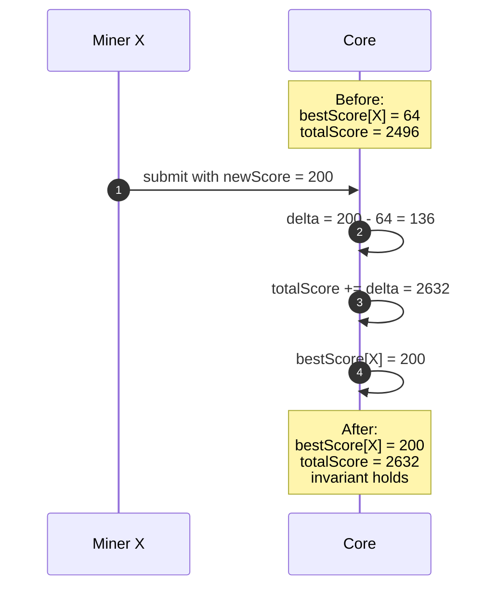

This invariant is what allows the claim formula to work correctly. At claim time, the miner's share equals pool times their best divided by total score, which is well defined precisely because total score is the sum of all participants' bests. If the invariant were ever violated, shares would not sum to the pool and over minting or under minting could happen. Every code path that touches best score must update total score by the delta, and every code path that reads best score or total score must do so consistently. This is the discipline the contract must enforce everywhere.

### Claiming

A miner calls withdraw on the Core, specifying which pool they want to withdraw from. The Core checks whether the miner has a dangling last active round that needs settling (same as the sixth step of submission), settles it if so, adds the computed share to the pending balance, and clears the last active round pointer. It then reads the pending balance, mints or transfers that many tokens to the miner, and zeroes the pending balance.

The entire withdraw operation is a handful of storage reads, one or two writes, and a mint or transfer. Constant cost regardless of how many rounds the miner accumulated rewards across. This is the payoff for doing the settlement work incrementally on every submission: at the moment of withdrawal, the work is already done.

If the miner wants to withdraw but hasn't submitted in a long time (so there is no fresh submission to trigger settlement), they can call a dedicated settle function that does only the settlement step without the submission logic. This lets them close out their last active round and claim without having to first submit a proof of work.

Miners can also batch withdraw across multiple pools in one transaction, via a withdrawMany function that takes a list of pool IDs and processes each in a bounded loop. The cap on the list length is configurable, typically 16 or so, to keep gas per transaction predictable.

---

## Minimum Target and Retargeting

The minimum target controls which submissions are eligible for share accounting. Below the minimum, submissions are rejected entirely. At or above the minimum, they earn shares scaled by how much they exceed it. This is the lever that controls the submission rate into the pool.

Each pool maintains its own minimum target. At launch, the creator sets an initial target, which is the floor for all submissions during the first retargeting window. After that, the Core retargets automatically based on observed submission rate.

Retargeting uses a linear weighted moving average of the last N closed rounds' submission counts. The algorithm is simple: if the weighted average exceeds the target submission rate (a configuration parameter, defaulting to around 100 submissions per round), the minimum target tightens, meaning future submissions will need to demonstrate more work to qualify. If the weighted average is below the target rate, the minimum target loosens. The adjustment magnitude is proportional to the deviation, with caps to prevent wild swings in a single retarget.

The retarget happens lazily, not eagerly. The Core doesn't run a retarget function at round close, because that would be an untriggered call and there is no one to pay for it. Instead, when the next round's first submission arrives, the Core notices that the previous round closed without retargeting and performs the retarget as part of processing that submission. The gas cost falls on the first submitter of the new round, which is a slight unfairness, but it is a one time cost per round and in practice it is small (a few storage reads and one write).

The ring buffer of recent round statistics is stored as a fixed size set of slots. At pool creation, it is zeroed. As rounds close, each round's submission count is written to slot (round ID modulo N), overwriting the oldest. The retarget computation reads N slots and computes the weighted average, all in a bounded loop. This never grows.

### The interaction between caps and retargeting

Recall that the per miner cap (10) and per round total cap (500) are enforced regardless of the minimum target. Retargeting is meant to keep the submission rate somewhere around the target rate (say 100 per round), so the hard total cap (500) is just a safety valve for pathological cases. In normal operation, the minimum target adjusts to keep most rounds well under the hard cap.

If a pool has very low hashrate, the minimum target might drop all the way to zero (or rather, to the weakest possible value), meaning any valid submission qualifies. This is fine. The pool simply pays out even to weak submissions. If hashrate suddenly spikes, the minimum target rises as fast as retargeting allows, eventually reaching a new equilibrium. The hard cap (500) exists so that, during the retargeting transient (say, the network hashrate tripled in a day and the retarget hasn't caught up), no single round can be spammed into infeasibility.

---

## Reward Determination

Each round's reward pool is either minted fresh by the Core (Modes A and B and D) or drawn from a deposited reserve (Mode C). Four ways exist to determine how much gets allocated to each round's pool: fixed, halving, or tail emission for built ins, plus arbitrary logic via reward hooks for creators who want custom schedules.

### Fixed schedule

The simplest schedule. Each round's reward is a constant, forever. Good for pools that want steady emission from day one, with no supply cap and no decay (Modes A, B) or steady distribution from reserve until depletion (Mode C). The creator provides one parameter, the reward per round. The Core computes it as a read from the config, essentially free gas wise.

### Halving schedule

The classic Bitcoin model. The reward starts at some initial value and halves every H rounds, approaching zero over time. The creator provides two parameters, the initial reward and the halving interval H. The Core computes it as initial reward shifted right by (rounds since genesis divided by H), which is a couple of integer operations. At some point the shift exceeds the bit width of the reward value and the effective emission becomes zero. This is how the total supply is capped, since the geometric sum of halvings converges.

### Tail schedule

Halving until a specified round, then switching to a fixed tail reward forever. Used by Monero and a few others. The creator provides the initial reward, the halving interval, the tail start round, and the tail reward. The Core computes the round's reward by halving logic if the round is before the tail start, or by the constant tail reward otherwise.

### Reward hooks

For anything more complex, the creator deploys a reward hook contract implementing the IRewardHook interface. The interface is minimal: a single method that takes the round ID and returns the reward amount. The Core calls this method when it needs to know a round's reward.

Reward hooks can do arbitrary computation within gas limits. Common uses include reading an oracle price and scaling the reward inversely so that the pool maintains a target USD value per round, reading the token's total supply and reducing emissions as the supply approaches a cap, reading a governance vote and adjusting emissions based on the outcome, or combining multiple signals into a composite emission formula.

The Core protects itself from misbehaving hooks in several ways. First, the hook call is made with a gas budget, meaning if the hook consumes more than the allotted gas, the call reverts and the Core falls back to a safe default (typically the inline fixed schedule with the last known reward value). Second, if the hook reverts for any reason, the Core also falls back to the safe default. This ensures a broken or malicious hook can never brick the pool. Third, the hook's return value is clamped between zero and a maximum value (the remaining mintable supply for Modes A/B/D, or the remaining reserve for Mode C). A hook cannot cause over minting or over distribution no matter what it returns. Fourth, reentrancy guards prevent the hook from calling back into the Core in ways that could mess with mining state during a round close.

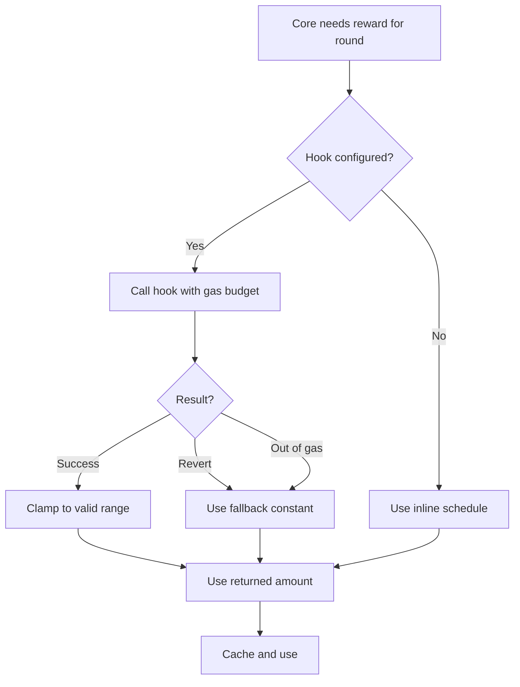

The hook address is recorded in the pool configuration at creation and cannot be changed afterward. If the creator wants to upgrade their hook, they need to launch a new pool.

### When is the reward computed

Two strategies exist for when the Core evaluates a round's reward. The eager strategy is to compute the reward at round open (the first block of the round), store it in the round's slot, and use that stored value at settlement. The lazy strategy is to compute the reward at first settlement (the first time a miner claims a share from that round) and store it then. Eager gives miners a predictable reward to mine toward, because they can query the Core and see what that round is worth. Lazy defers the computation cost to claim time.

The protocol uses the eager strategy for built in schedules (since they're cheap enough to compute inline) and eager for hooks (where the Core calls the hook once, at the first submission of the round, caches the result, and uses the cache for all subsequent settlements from that round). This gives miners the predictability they want without incurring a per submission cost.

---

## Multi Algo Pools

A pool can be configured with multiple algorithms that run in parallel, each with its own pipeline, target, curve, caps, and weight. The per round reward is split among the algorithms according to their weights. This is useful for pools that want to support multiple hardware classes fairly, rather than picking one and leaving the others out.

At pool creation, the creator specifies an array of algorithm configurations plus weights expressed in basis points (out of 10,000). The weights must sum to exactly 10,000, which the Core validates. Each algorithm gets its own independent pipeline, target, curve, minimum target, retargeting state, round score accounting, and caps.

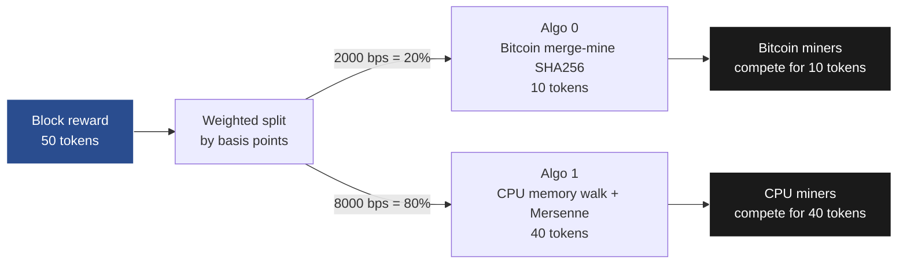

When a miner submits, they specify which algorithm index they're submitting to. The Core looks up that specific algorithm's configuration, runs its pipeline and target, and updates that algorithm's slice of the round state. Miners are free to submit to any combination of algorithms, including mining all of them with different hardware.

At round settlement, the Core splits the round's reward pool among the algorithms by weight. Algorithm i's subtotal equals round pool times algorithm i's weight divided by 10,000. Within each algorithm, shares are distributed among that algorithm's miners using the standard formula.

The practical effect is that a pool can say: 20 percent of every round's reward goes to Bitcoin merge-mining (attracting Bitcoin miners), 60 percent goes to a CPU-favored algorithm (attracting retail miners), and 20 percent goes to a GPU-favored matmul algorithm (attracting GPU operators). All three groups compete for their own slice. Neither outcompetes the others. A diversified miner with access to multiple hardware classes can mine all three slices.

### Caps in multi algo pools

The 10 per miner per round cap applies independently per algorithm, meaning a miner can submit 10 to each algorithm. The 500 per round total cap applies independently per algorithm too. This is a design choice: making them per algorithm lets miners fully participate in all sub pools without running into per pool limits that would effectively divide their allowance. If spam becomes a problem, a creator could add a pool wide cap at deployment, but it's not the default.

### An example multi algo config

A pool called BiCoin deploys with two algorithms. Algorithm 0 is Bitcoin merge-mining SHA256 against Bitcoin difficulty divided by 1,000,000, designed to capture a slice of the Bitcoin mining industry's existing shares. Weight is 3,000 basis points (30 percent). Algorithm 1 is a sequential memory walk of 2MB plus a Mersenne prime multiply add chain, designed for CPU miners with no specialized hardware. Weight is 7,000 basis points (70 percent).

The reward schedule is halving, starting at 50 tokens per round with a halving every 210,000 rounds. Round length is 1 block. Variance curve is LINEAR for both algorithms.

In a typical round, Bitcoin pool operators with spare share streams submit to algorithm 0 when the token's reward exceeds gas cost amortized over their expected share rate, and CPU miners submit to algorithm 1 using consumer hardware. Each algorithm's share of the 50 token reward is computed separately: 15 tokens divided among Bitcoin merge-miners by their scores, 35 tokens divided among CPU miners by theirs. Both groups get paid. The creator has built a coin whose mining economics reach both the Bitcoin industry and the retail CPU demographic, with neither crowding out the other.

---

## Consuming Proofs from Other Contracts

Toil's most strategically important surface beyond pool creation is its verify-only entry point for other OPNet contracts. This is what turns Toil from "a coin minting framework" into "a composable primitive that other applications import."

The pattern is simple. A consuming contract calls a read-only Core function that takes a pipeline reference and a submission (nonce, witness, miner address, and reference block hash) and returns whether the submission is valid under that pipeline's rules. The function performs no state changes, emits no events, updates no pool accounting. It only runs the pipeline and target deterministically and returns the verdict. The consuming contract then uses the verdict in its own business logic.

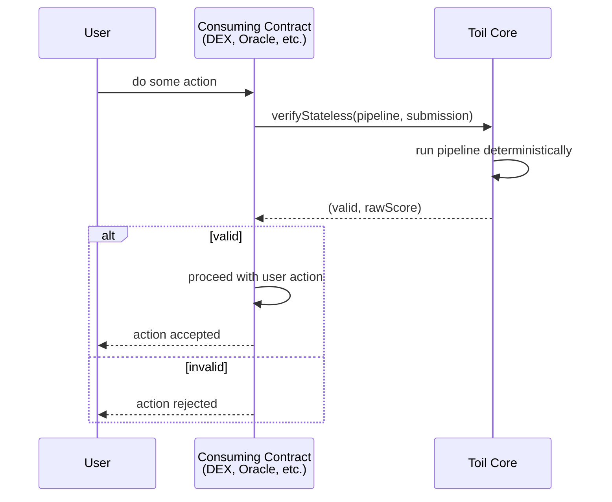

### Patterns enabled by the verify-only entry point

A DEX contract can require recent proofs as an anti-MEV gate. To submit a swap during a congested block, a user must attach a Toil proof from a specific pipeline. Searchers who want to front-run other users pay in real compute rather than gas priority. Regular users whose trades are not latency-sensitive can ignore this entirely.

An airdrop contract can weight distribution by accumulated mining activity. To claim a full airdrop share, a user proves they submitted valid proofs to a designated pool over the last N blocks. Sybils who would normally clone themselves across many addresses now have to perform proportional work for each address, which changes the economics of Sybil attacks against airdrops.

A governance contract can weight votes by verified hashrate rather than (or in addition to) token balance. Miners participating in governance bring a stake that is denominated in compute contribution, which is different from capital-weighted voting and arguably more aligned with operational engagement.

An oracle contract can require data submitters to attach mining proofs as a kind of participation bond. Bad data providers can be blacklisted from future submissions, and the compute cost of getting on the oracle makes Sybil attacks expensive.

A hashrate-selected committee contract can ask the Core "who are the top N miners on pool X over the last K blocks" and select those addresses as committee members for whatever purpose the contract needs (multisig signers, oracle aggregators, dispute resolvers, anything requiring a distributed and rotating set of accountable actors).

A bounty marketplace contract can accept postings of the form "I will pay this amount in this OP20 to whoever first submits a valid Toil proof for pipeline X against target Y before block Z." The first successful submitter, verified via the Core's stateless entry point, claims the bounty. This turns the Core into a general computation market where compute buyers and sellers settle on chain.

### Why this matters more than the reference implementation

None of the above requires Toil to know anything about the consuming contract. The Core exposes a pure verification function and stays out of the consuming contract's business. The consuming contract decides how to use the verdict. This is the definition of a composable primitive. The Core does not need to anticipate every use case, and the ecosystem does not need to wait for Toil's roadmap to extend proof-of-work into new domains.

Coin minting is one consumer of this primitive, and it happens to be the most obvious one. But the Core's long term value is measured by how many other OPNet contracts end up importing proofs into their own logic. That is the ecosystem growth vector Toil enables, not the coin launches themselves.

---

## The Mixer Extension Model

The protocol needs to be able to grow its set of supported mixers over time without requiring migrations or breaking existing pools. The mixer extension model is how this works.

### Built in mixers

The Core ships with a fixed set of built in mixers whose logic is inline in the Core's bytecode. This is purely a gas optimization: calling an inline function is much cheaper than calling an external contract. The built in set covers the most common primitives and is chosen so that most reasonable pool configurations can be built entirely from built ins, with no external calls needed.

Built in mixers have stable small ID numbers (say 1 through 50) reserved for them. They cannot be added, removed, or modified after Core deployment, because they are part of the Core's code. To change a built in, you would have to redeploy the Core, which is a protocol level event outside the scope of routine operation.

### External mixers

An external mixer is a standalone contract that implements the IMixer interface. It has its own address, its own bytecode, and its own deployment. When someone wants to add a new mixer to the protocol (say, Scrypt, because they want to launch a pool that mimics Litecoin; or Argon2 because they want maximum CPU resistance; or a custom productive-work mixer like a matrix factorization step), they deploy that implementation as an external mixer contract.

To make it available to pool creators, they register it with the Core. Registration is a two step process. First, the mixer author calls proposeMixer on the Core, passing the mixer's address along with metadata (name, version, description, max witness size, estimated gas per call). This creates a pending proposal with a proposal ID. Second, a governance process approves the proposal. At launch, governance is simply the Core owner. Over time, governance evolves toward a more decentralized mechanism (timelocked multisig, then on chain voting, then possibly fully permissionless).

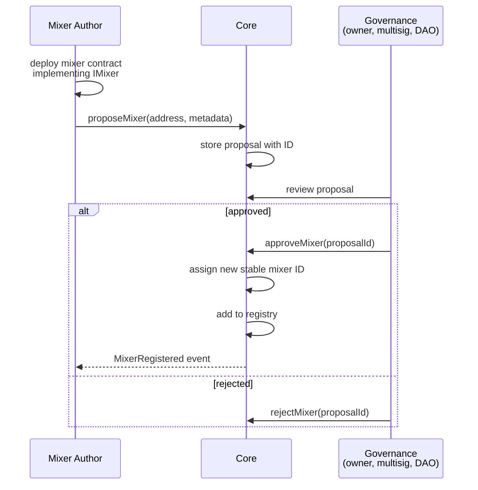

Once approved, the external mixer gets a new stable registry ID (say, 51 or higher) and is now available for any new pool to reference. Existing pools are unaffected, because their pipeline is frozen to the registry IDs they referenced at creation.

### The IMixer interface

An external mixer must conform to a strict interface for safety. The required method takes three byte arguments (state, params, witness slice) and returns two values (new state, witness bytes consumed). The method must be pure, meaning it cannot modify storage, emit events, call other contracts, access block properties, or do anything else with side effects. This is enforced in two layers: first, the Core validates the mixer's metadata at registration (the registration metadata declares the mixer as pure and specifies its gas budget), and second, the Core wraps every mixer call in a sandboxed sub call that enforces a gas limit and catches any attempt to do something forbidden.

The reason for strict purity is that miners need to be able to compute mixer results off chain identically to how the Core computes them on chain. If a mixer had side effects, miners would see different results than the Core, and mining would be impossible. Purity is also what allows the Core to simulate submissions at pool deployment for gas cost estimation, because pure functions can be called without any risk of state corruption.

### External mixer gas cost

External mixers are significantly more expensive than built in ones due to the cross contract call overhead (a few thousand gas per call at minimum, plus the cost of encoding and decoding arguments). A pipeline that uses one external mixer among three built ins will be maybe 20 percent more expensive to verify than an all built in pipeline. A pipeline with all external mixers might be twice as expensive. Creators should be aware of this tradeoff when designing pools. For commonly used primitives, adoption into the built in set via a future Core upgrade is the path to maximum gas efficiency.

### Deprecation and versioning

The Core never removes mixers from the registry. If a bug is discovered in a registered external mixer, it cannot be silently fixed, because doing so would change the behavior of existing pools that reference it. Instead, the fixed version is registered as a new mixer with a new ID (say, MersennePrime v2 at a new ID), and new pools can choose to use the fixed version. Old pools continue using the original version, for better or worse.

Pool creators should pay attention to mixer versioning when configuring their pipelines. A future frontend might display mixer trust flags based on whether they have had known issues, have been audited, have been used in many pools, and so on. The protocol itself does not make these judgments, it just provides the infrastructure for creators to make informed choices.

### Why the extension model matters more than any shipped mixer

The long term value of Toil lives in how the mixer registry grows, not in which mixers ship on day one. Every new mixer is a new shape of computational work the framework can verify, which is a new class of hardware bias, a new kind of productive work, a new primitive available to pool creators and consuming contracts. Getting the extension mechanism right (stable IMixer interface, trustworthy registration process, versioning discipline) is more important than shipping a perfect starter set, because the starter set is replaceable and the extension mechanism is not.

---

## The Reward Hook Extension Model

Reward hooks work differently from mixers. They are not part of a shared registry. Each hook is deployed by the pool creator and referenced only by the pool that wants to use it. There is no governance process for hooks. Anyone can write and deploy a hook, and any pool creator can reference any hook's address at pool creation.

This is because hooks only affect the pool that opts in. A broken or malicious hook cannot hurt anyone except the miners of the specific pool that uses it. In contrast, a broken mixer in the shared registry could hurt every future pool that references it, hence the approval process for mixers. Hooks are a strictly local concern.

### The IRewardHook interface

The minimum interface is a single method, computeRoundReward, which takes the round ID and current block number and returns the round's reward amount. This method is called by the Core at the first submission of each round, and its return value is cached in the round's slot for use by all subsequent operations on that round.

The hook may optionally implement callback methods for round lifecycle events. onRoundOpen is called (if implemented) when a round begins, allowing stateful hooks to track round starts. onRoundSettled is called when a round's final submission count and total score are known, allowing stateful hooks to log statistics for use in future emissions. Implementing these callbacks is optional, hooks that don't need them simply don't expose them.

### Safety constraints on hooks

The Core protects miners from hook misbehavior through several mechanisms.

**Gas budget.** Every hook call is made with a capped gas allowance, typically 100,000 gas. If the hook consumes more, the call fails and the Core uses a safe fallback reward.

**Revert handling.** If the hook reverts, the Core catches the revert and uses the safe fallback.

**Return value clamping.** The hook's returned reward is clamped to the range zero to remaining mintable supply (or remaining reserve for Mode C pools). A hook that tries to distribute more than what is available simply has its return value capped. A hook that returns a negative number (after bit interpretation) gets clamped to zero.

**Reentrancy prevention.** While the hook call is in progress, the Core sets a reentrancy flag that blocks any sub call back into the Core's mining state functions. The hook can still read public state, but it cannot submit on someone's behalf, cannot claim, and cannot modify reward state.

**Immutability.** Once set at pool creation, the hook address cannot be changed. This prevents the creator from rugging miners by changing the hook to return zero after bootstrap.

### Example hook scenarios

A "burn on inactivity" hook looks at the previous round's submission count and scales this round's reward down if the previous round had fewer than some threshold of submissions. This discourages creators from launching pools that only have one or two miners, because the emission shrinks until more miners show up.

A "price pegged" hook reads an oracle for the token's USD price and scales emissions inversely. If the price rises, the emission per round drops to keep the USD value of the round's reward roughly constant. If the price falls, the emission grows. This creates a soft supply control mechanism without any explicit cap or schedule.

A "hashrate smoothed" hook looks at the total score over a rolling window of past rounds and scales the reward to incentivize a target hashrate. If hashrate has risen far above a baseline, the reward drops. If hashrate is falling, the reward rises. This creates a feedback loop that attempts to keep the pool's mining economics stable over time.

A "governance controlled" hook stores a mutable reward parameter controlled by an on chain DAO. The DAO can vote to change the parameter, and the hook returns the parameter as the reward. This lets a pool community adjust emissions democratically. Of course, this centralizes trust in the DAO, which miners must be comfortable with before participating.

None of these are expressible with the built in schedules. The hook system is what lets a creator build any emission logic they can imagine.

---

## Security and Safety Considerations

This section catalogs the known attack surfaces and the mitigations for each. The common thread across all of these is defense in depth, meaning every category of failure has multiple independent safeguards so that a single bypass cannot compromise the protocol.

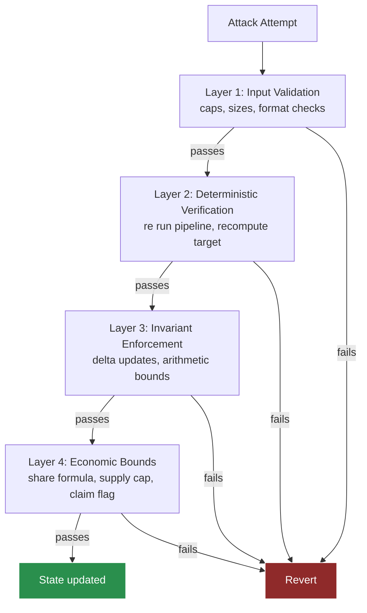

### Reentrancy

Every state changing function on the Core (submit, claim, withdraw, hook callback targets) is protected by a reentrancy guard. The guard is a single storage flag that is set at function entry and cleared at function exit. Any reentrant call while the flag is set reverts immediately. This prevents a malicious mixer, hook, or external contract from calling back into the Core mid execution and corrupting mining state.

Mixers are also forbidden from making cross contract calls at all, as enforced by the sandbox wrapper. This is defense in depth: even if the reentrancy guard somehow failed, the mixer could not reach the Core anyway, because the Core's external call enforcement blocks the call at the boundary.

### Overflow and underflow

Every arithmetic operation that could overflow uses the SafeMath patterns prescribed in OPNet's development guidelines. For u64 score arithmetic, the framework uses explicit saturation (if an operation would overflow, the result is clamped to u64 max). For u256 reward arithmetic, the framework uses the mul div pattern that handles 512 bit intermediates to avoid overflow during multiply before divide. The totals invariant is preserved even at overflow boundaries, because delta updates can be safely computed with appropriate checks.

### Mint authority and reserve integrity

The Core's ability to mint or distribute tokens is strictly governed by mode. For Mode A (Core-deployed OP20s) and Mode D (Core-deployed NFTs), the Core's internal mint authority is the sole source of truth. For Mode B (externally owned OP20 with delegated authority), the Core enforces per pool total supply caps so that even a misbehaving external OP20 cannot cause the Core to authorize more minting than the configuration allows. For Mode C (retrofit pools distributing deposited supply), the Core tracks the reserve balance directly and never distributes more than was deposited.

If the external OP20 used in Mode B has a hidden backdoor that lets its owner mint unlimited tokens outside the Core's view, Toil cannot protect miners from that. This is why attaching to an existing OP20 in Mode B is a trust assumption on the external contract's bytecode. Mode C sidesteps this entirely because the Core holds the reserve.

### Dust handling

Integer division rounds down, so a small amount of dust (at most one token per round per algorithm) is left unminted after all miners claim their shares. The pool's dust policy determines what happens: BURN leaves it unminted forever, reducing the pool's effective distribution very slightly, and ROLLOVER adds the dust to the next round's pool. Neither is a security issue, just a minor economic choice.

### Submission replay

A miner might try to resubmit the same (nonce, witness) combination to earn multiple credits. This is prevented because the score update logic only credits strictly better scores. Resubmitting the same submission produces the same score as the first submission, which is not strictly better, so no state changes. The submission counter does increment, but that just counts toward the miner's per round cap.

Cross round replay is prevented by the state's dependence on the round's seed (the previous round's block hash). Since the seed changes every round, the same (nonce, witness) that was valid in round R will not be valid in round R plus 1 (with overwhelming probability, since changing the seed changes the final hash).

Cross miner replay is prevented by the state's dependence on the miner's address. A submission that Alice validly computes cannot be resubmitted by Bob, because Bob's state would include his own address, producing a different final hash.

### Grinding attacks

A miner might try to find a weakness in the pipeline that lets them compute submissions with less than expected work. The anchor pattern (SHA256 at the start and end of the pipeline) is the standard defense. If an attacker finds an algebraic shortcut through, say, the Mersenne prime multiply section, the SHA256 anchors bound how much damage they can do, because they still need to produce a SHA256 pre image that beats the target, which is Bitcoin grade hard.

Creators are strongly encouraged to always include at least one SHA256 anchor in their pipelines, ideally one at each end. The protocol does not enforce this as a hard rule, because it is conceivable that some future sophisticated pipeline design does not need it, but the reference documentation emphasizes this as a best practice.

### Hook griefing

A malicious or buggy hook could return zero, revert, or consume all available gas. All three cases are handled via the fallback mechanism described earlier. In the worst case, a pool with a bad hook behaves as if it had a fixed reward of the fallback value for every round, which is degraded but not broken.

### Mixer bugs

A bug in a mixer is the most severe class of failure, because it can potentially let miners compute valid submissions with less work than intended. Mitigations include thorough audit of any mixer before registration, a conservative registration process that starts permissioned and only relaxes over time, versioning so that bugs can be fixed by deploying new versions without affecting old pools, and creator education so they pick well audited mixers for their pipelines.

Even with these measures, a bug is possible. The worst case consequence is that a specific pool's economics become broken (miners extract too much reward, devaluing the token). The blast radius is limited to that one pool and any others that use the same buggy mixer. Users of other pools are unaffected. This is why bug impact is bounded and recoverable (creators of affected pools can launch new pools with fixed mixers).

---

## A Worked Example from Start to Finish

Let me walk through a complete lifecycle of a pool called DocCoin, designed by a hypothetical developer named Alice who wants to make a CPU favored coin with predictable emissions.

### Deployment

Alice sits at the frontend and configures her pool. She chooses Mode A (fresh coin). She names it DocCoin with symbol DOC. She sets total supply cap at 21,000,000 tokens with 8 decimals. She designs a pipeline of four mixers: SHA256 anchor at the start, sequential memory walk of 1 MB with 30,000 iterations (to create memory pressure GPUs dislike), Mersenne prime multiply add with 5,000 rounds (to create weird arithmetic GPUs handle inefficiently), and SHA256 anchor at the end. She picks the standard "hash less than target" target type, parameterized with an initial minimum that corresponds to roughly 20 bits of difficulty. She picks LINEAR variance curve. She picks HALVING schedule with 50 initial reward per round, halving every 210,000 rounds. She picks single algorithm (not multi). She sets round length to 1 block. She sets caps at 10 per miner and 500 per round. She picks BURN dust policy.

The frontend packs the configuration and calls Core.createPool. The Core validates: all mixer IDs exist, pipeline witness size is within limits, the single submission simulation runs in about 2.5 million gas (well under the OPNet transaction ceiling), emission parameters are valid. The Core assigns DocCoin the next available pool ID (say, 47). It deploys a new OP20 wrapper contract for DocCoin, configures it to accept mint calls only from the Core, and records the wrapper's address. It stores the pool configuration under pool ID 47.

Alice's transaction completes. She spent maybe 15 minutes at the frontend and one OPNet transaction fee. DocCoin is now live and mineable. The frontend displays a mining page showing the pipeline, target, current minimum difficulty, round length, and current reward per round.

### First round

Block 1 on OPNet after the pool deployment is the start of round 0 for DocCoin. The round's reward pool is computed: 50 tokens (the initial HALVING value), because the round index divided by 210,000 is zero. The Core caches this.

Three miners show up: Bob, Carol, and Dave. All have desktop CPUs. Bob finds a valid nonce after 3 minutes of computing. His raw score is 1.5 (meaning he found a hash 1.5 times better than the minimum target). Under LINEAR, his stored score is 1.5, rounded to integer 1 (or represented in fixed point, but for this illustration let's round). Carol submits with raw score 4. Dave submits with raw score 2.

The Core processes Bob's submission first: total score goes from 0 to 1, best score for Bob becomes 1, Bob's last active round is 0. Then Carol: total score goes from 1 to 5, best for Carol becomes 4, her last active round is 0. Then Dave: total score goes from 5 to 7, best for Dave becomes 2, his last active round is 0.

The round ends when block 2 is mined. Total score is 7. Rewards per miner when they eventually claim are shown below.

| Miner | Formula | Result |
|---|---|---|
| Bob | 50 times 1 divided by 7 | 7 tokens |
| Carol | 50 times 4 divided by 7 | 28 tokens |
| Dave | 50 times 2 divided by 7 | 14 tokens |
| Dust | 50 minus 49 | 1 token burned |

None of the miners have claimed yet. The values sit in storage waiting.

### Subsequent rounds

Rounds 1 through 100 proceed similarly. Various miners come and go. Bob mines consistently, Carol drops out, Dave mines in bursts, new miners Eve and Frank appear. Each submission runs the pipeline, updates the round's state, and settles the miner's previous round if applicable.

After round 20, Bob submits his first proof of work for round 21. The Core notices Bob's last active round (round 20) is now closed (because current round is 21 which is greater). Before processing Bob's new submission, the Core settles Bob's round 20 share: it reads pool for round 20, Bob's best score for round 20, and total score for round 20, computes Bob's share, and adds it to Bob's pending balance. It clears Bob's last active round pointer. Then it processes the new round 21 submission normally.

This happens implicitly on every "new round" submission. After 100 rounds, Bob has a healthy pending balance representing his rewards from rounds where he was active. He has not called withdraw even once.

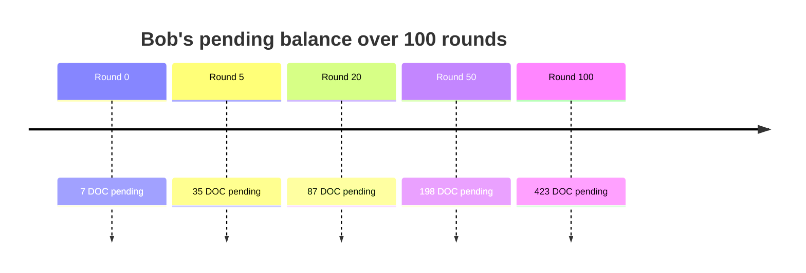

### Withdrawal

Bob decides to claim his accumulated rewards. He calls withdraw on the Core, specifying pool ID 47 (DocCoin). The Core checks if Bob has a dangling last active round. If his current round 100 submission hasn't been followed by a round 101 submission yet and round 100 is still open, there is nothing to settle (round 100 is still active). If he hasn't submitted in a few rounds and round 95 was his last, then the Core settles round 95 first. Either way, the settlement step is at most one round's worth of math.

The Core reads Bob's pending balance (say, it totals 147 DocCoin from his 50 or so rounds of participation), mints 147 DocCoin to Bob via the wrapper contract, and zeros the pending balance. Bob's wallet now holds 147 DOC tokens as a standard OP20, which he can send, trade, or hold. The entire withdrawal is one transaction, constant cost, regardless of how many rounds he mined in.

### Over a longer timespan

Let's assume DocCoin gets healthy adoption. After a year, the pool has had many rounds (the exact number depends on OPNet's block time, but say 52,560 rounds for illustrative purposes). At round 210,000, the halving kicks in. The reward per round drops from 50 to 25 DOC. Miners keep mining, though their per round share is halved. Existing pending balances are unaffected.

At round 420,000, the reward drops to 12.5. At 630,000, to 6.25. And so on. After about 30 halvings, the reward is effectively zero and the total supply has converged to just under 21 million DOC. Mining ends (no reward to compete for). Existing holders have their tokens, just like Bitcoin's model.

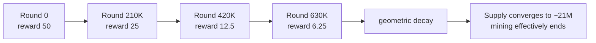

At any point during this lifecycle, the protocol has done zero iteration over any unbounded list. Every operation has been constant cost in the number of storage reads and writes. The pool has supported arbitrarily many miners across arbitrarily many rounds with no performance degradation.

---

## Parameters Reference

For the creator, here is the full list of parameters that can be configured at pool deployment, organized by category.

### Mode selection

Pool creation mode (enum: FRESH_OP20, EXISTING_OP20, RETROFIT_DEPOSIT, NFT_MINT). Determines how rewards flow.

### Coin parameters (Mode A: FRESH_OP20 only)

| Parameter | Type | Constraint |
|---|---|---|
| Name | string | 1 to 32 ASCII characters |
| Symbol | string | 2 to 8 ASCII characters |
| Decimals | u8 | typically 8 to match Bitcoin convention |
| Total supply cap | u256 | in base units accounting for decimals |
| Initial supply to creator | u256 | optional premine, counts against cap |

### Coin parameters (Mode B: EXISTING_OP20 only)

| Parameter | Type | Notes |
|---|---|---|
| External OP20 address | address | must be a deployed OP20 contract |
| Proof of ownership | bytes | valid signature from the external OP20 owner |
| Mint cap | u256 | max additional supply the Core can mint via this pool |

### Coin parameters (Mode C: RETROFIT_DEPOSIT only)

| Parameter | Type | Notes |
|---|---|---|
| Target OP20 address | address | any deployed OP20 |
| Reserve deposit | u256 | amount deposited into the Core as the pool's reward reserve |

### NFT parameters (Mode D: NFT_MINT only)

| Parameter | Type | Notes |
|---|---|---|
| Collection name | string | 1 to 32 ASCII characters |
| Max supply | u64 | total NFTs the pool can mint |
| Metadata derivation | enum | how final pipeline state maps to NFT metadata |

### Pipeline

An ordered list of (mixer ID, parameters) tuples, length 1 to 8. Parameters are mixer specific byte strings. Total witness size across all mixers must fit in calldata (practical limit well under 1 MB).

### Target

Target ID (integer from the target registry). Target parameters (byte string). Initial minimum target as a u256.

### Variance

Variance curve (enum: LINEAR, SQRT, LOG, CAPPED). If CAPPED, the cap value as u64.

### Round structure

| Parameter | Type | Default | Range |
|---|---|---|---|
| Round length (blocks) | u32 | 1 | 1 to 10,000 |
| Per miner submission cap | u16 | 10 | 1 to 100 |
| Per round total submission cap | u32 | 500 | 10 to 10,000 |

### Retargeting

| Parameter | Type | Default | Purpose |
|---|---|---|---|
| Target submission rate | u32 | 100 | Submissions per round to aim for |
| Retargeting window | u16 | 10 | Number of past rounds to consider |
| Retargeting magnitude cap | u16 bps | 2,500 | Max plus or minus 25 percent per retarget |

### Reward schedule

Schedule type (enum: FIXED, HALVING, TAIL, HOOK).

| Schedule | Required parameters |
|---|---|
| FIXED | constant reward per round |
| HALVING | initial reward, halving interval |
| TAIL | initial reward, halving interval, tail start round, tail reward |
| HOOK | hook contract's address |

### Multi algo

An optional array, length 2 to 8, where each entry contains a full algorithm configuration (pipeline, target, variance, caps, retargeting, minimum target) plus a weight in basis points summing to 10,000 across all entries.

### Dust policy

Dust handling (enum: BURN, ROLLOVER).

### Meta

Optional description (string, up to 256 characters, stored as event metadata at deployment, not used by contract logic).

### Validation

All parameters are validated at deployment. Invalid configurations (bad mixer IDs, non summing weights, impossible targets, zero halving interval, undeposited reserve for Mode C, missing ownership proof for Mode B, and so on) cause the creation transaction to revert with a specific error code identifying the offending parameter.

---

## Summary

Toil is a protocol for making verifiable proof of work a first class on-chain primitive on Bitcoin. It consists of three contracts: a Core that does everything, optional external mixer contracts that extend the library of available hash primitives, and optional reward hook contracts that customize emission logic for specific pools. The Core exposes both a stateful submission interface for miners and a stateless verification interface for other OPNet contracts.

The four mining pool modes (fresh OP20, existing OP20 attachment, retrofit from deposited reserve, NFT minting) cover every practical case for converting computational work into an on-chain asset. Creators configure their pool's hardware bias via the mixer pipeline, variance profile via the variance curve, emission economics via the reward schedule or hook, and fairness tradeoffs via the caps and minimum target. Multi algo pools let creators support multiple hardware classes in a single pool, including direct Bitcoin merge mining alongside custom algorithms targeting CPUs or GPUs.

The most strategically important capability Toil enables is merge mining with Bitcoin, which is possible only because OPNet is a consensus layer on Bitcoin rather than a separate chain. This gives Toil a pipeline to the world's largest pool of mining hardware that no other smart contract platform can access. The second most important capability is the verify-only entry point that lets other OPNet contracts consume proofs as a pure function, turning Toil from a coin launcher into a composable primitive that every OPNet application can build on.

QBTC is the inaugural deployment that makes these capabilities concrete. It is an OP20 token on OPNet, minted by Bitcoin's own hashrate through a single stage double SHA256 pipeline, with a supply curve that mirrors Bitcoin's in real time by reading Bitcoin's block height from OPNet's native block context. It is custodied under MLDSA, which is quantum safe by construction, while Bitcoin's own custody under ECDSA and Schnorr is not. QBTC is not wrapped Bitcoin, not bridged Bitcoin, not a peg of any kind. It is a parallel asset whose mining demographic is Bitcoin's mining industry and whose monetary rules are Bitcoin's monetary rules, filling the Bitcoin-analog DeFi pair role on OPNet that WBTC fills on Ethereum, and doing so without any trust assumption beyond OPNet's own consensus.

The protocol is the protocol that made QBTC possible, plus everything else that wants to use the same primitive. Every design decision prioritizes immutability for miners, simplicity for creators, composability for consuming contracts, and constant gas cost for the protocol itself. The ecosystem that grows on top of the Core will decide what Toil becomes beyond QBTC. 

The primitive is the product, QBTC is the proof that the primitive matters, and the rest is open.